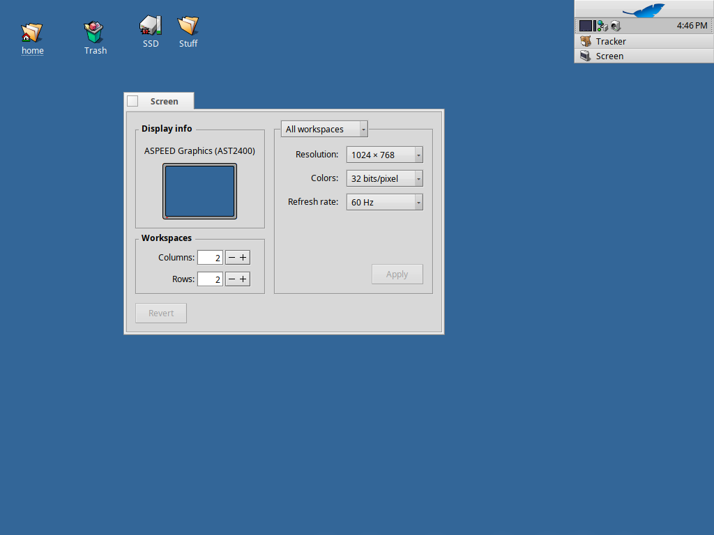

> [!NOTE]
> An LLM was used to aid in development of this code.

**Bug reports (please attach listdev output, syslog, and/or screenshots)
and PRs welcome! See "Logging Bugs / How to Help" section below.**

# AST2400 - Haiku GraphicsDriver

Haiku graphics driver for the **ASPEED AST2400 / AST2500 / AST2600**
family of integrated BMC GPUs. These chips are found on most Supermicro,
Dell, HPE, Asus server-line, and other enterprise server motherboards;
the BMC's onboard VGA is typically the board's default display output
even when no discrete GPU is installed.

Driver name `ast`, PCI vendor `0x1a03`, device `0x2000`. Generations are
distinguished at runtime via the PCI revision register, matching Linux's
`ast_detect_chip()` logic.

> [!NOTE]
> This is **not** an upstream Haiku driver. It is GPL v2-licensed (because
> it ports register sequences from Linux's `drivers/gpu/drm/ast/`) and
> distributed as a standalone `.hpkg` for users with affected hardware.
> There is no plan to upstream these changes — Haiku does not accept GPL
> drivers into its MIT tree.

Release history: see [`CHANGELOG.md`](CHANGELOG.md).

---

## Project Status

This driver is **early-stage**. Each phase below has to clear hardware
verification before the next starts.

| Phase | Goal | Status |
|---|---|---|
| 1 | Probe + bind PCI device, map BARs, no display output | ✅ verified on Supermicro X11SSH-LN4F |
| 2 | Accelerant skeleton — clones shared area, exposes mode list | ✅ accelerant loads, app_server picks our driver |
| 3 | Actual CRTC + PLL + encoder programming — drive a real mode | ✅ clean 1024×768@60Hz @ 32 bpp |
| 4 | EDID-driven mode list, multi-mode support | 🟡 in progress |
| 5 | AST2500 / AST2600 silicon-init deltas, polish | ⬜ not started |

As of 0.0.9 the driver actively programs the chip and produces a usable
Haiku desktop at 1024×768. Only that single mode is exposed; Phase 4
will replace the hardcoded mode with EDID-driven multi-mode support.

---

## Tested Hardware

| Brand | Board | Chip | PCI ID (rev) | Status |
|---|---|---|---|---|
| Supermicro | X11SSH-LN4F (Xeon E3-1230v5) | AST2400 | `1a03:2000` (rev 0x30) | ✅ Phase 3 — clean 1024×768@60Hz desktop, correct colors |

### Screenshot

Haiku Screen preferences reports the active driver as **ASPEED Graphics
(AST2400)** at **1024 × 768**, **32 bits/pixel**, **60 Hz** — driven
through the BMC's onboard VGA output on a Supermicro X11SSH-LN4F.




---

## Installation

Grab `aspeed_gfx_unofficial-<version>-x86_64.hpkg` from the
[releases page](https://github.com/KevinAdams05/AST2400/releases), drop it
in `~/config/packages/`, and reboot:

```sh
cp aspeed_gfx_unofficial-*.hpkg ~/config/packages/
shutdown -r
```

To revert, remove the `.hpkg` and reboot:

```sh
rm ~/config/packages/aspeed_gfx_unofficial-*.hpkg
shutdown -r
```

If the driver panics at boot, boot to safe mode and delete the `.hpkg` from
`~/config/packages/` before the next normal boot.

---

## Building from source

Building from source is not required — install the `.hpkg` above. If you
want to cut your own build (or contribute a fix):

1. Clone this repo.
2. Have a Haiku x86_64 source tree with cross-tools configured at
   `$HOME/haiku-build/haiku` (or pass a path as the first argument).
3. Run:
   ```sh
   scripts/build.sh
   scripts/package.sh 0.0.X
   ```
4. Output: `dist/aspeed_gfx_unofficial-0.0.X-x86_64.hpkg`.

---

## Logging Bugs / How to Help

[Open an issue](https://github.com/KevinAdams05/AST2400/issues) with as much
detail as possible. From Haiku, attach:

- syslog (`/var/log/syslog`) — especially lines beginning with `ast:`
- `listdev` output (the PCI ID + revision tell us the exact chip)
- The motherboard make and model
- A photo of the screen if you hit a KDL or visual corruption

If you can also boot Linux on the same hardware, the output of
`lspci -nn | grep -i aspeed` confirms the PCI ID and revision.

PRs are welcome. On your PR, indicate which board + BMC chip you tested on,
and include the PCI ID + revision.

Please adhere to the [`docs/STYLE_GUIDE.md`](docs/STYLE_GUIDE.md) for coding conventions
before opening a PR. There is a PR checklist that outlines a few key things to check.

---

## Why GPL v2 (not MIT)

Most Haiku drivers — including the bundled ones — are MIT. This driver is
**GPL v2 only** because it ports register sequences from Linux's
`drivers/gpu/drm/ast/`, which is GPL v2 only (no "or later" clause). The
combined derivative work must therefore also be GPL v2.

This means:

- **The driver cannot be upstreamed into Haiku** in its current form.
- The tradeoff is accepted as the price of being able to lean on the
  Linux driver as the authoritative reference — ASPEED hardware is too
  sparsely documented publicly to drive blind.

See [`docs/STYLE_GUIDE.md`](docs/STYLE_GUIDE.md) §16 for the full
licensing rationale.

---

## Source Material

The Linux `drivers/gpu/drm/ast/` driver is the primary porting source for
register sequences and silicon-revision handling. The
**AST2500 Software Programming Guide** (833 pages, 2017) is the
authoritative vendor reference — ASPEED maintained register-level backward
compatibility from AST2300 through AST2500, so the same SPG covers AST2400
modulo a small set of well-documented deltas.

`xf86-video-ast` (the older X11 driver) is a secondary reference,
MIT-licensed.

When this driver substantially ports a function from Linux, the upstream
copyright lines are preserved per [`docs/STYLE_GUIDE.md`](docs/STYLE_GUIDE.md)
§16.2.

---

## License

GNU GPL v2 only. See individual source files for copyright lines.
