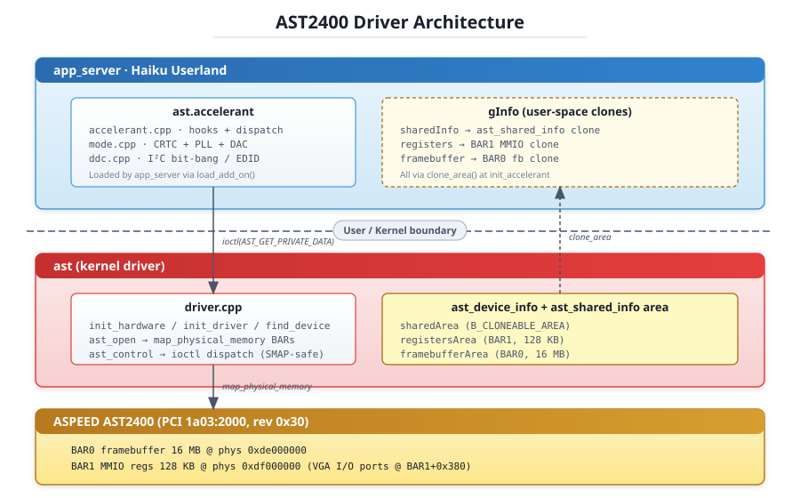
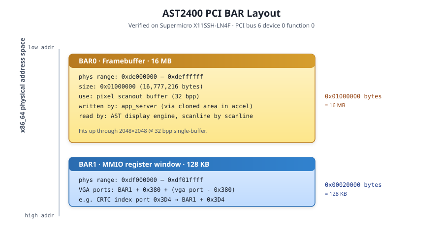
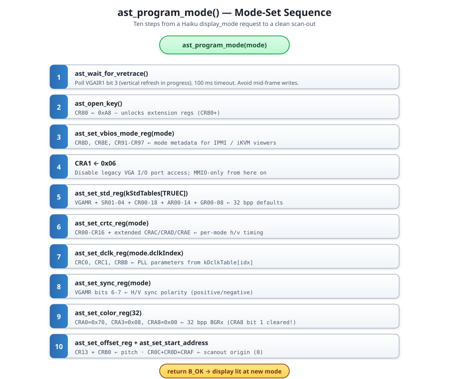
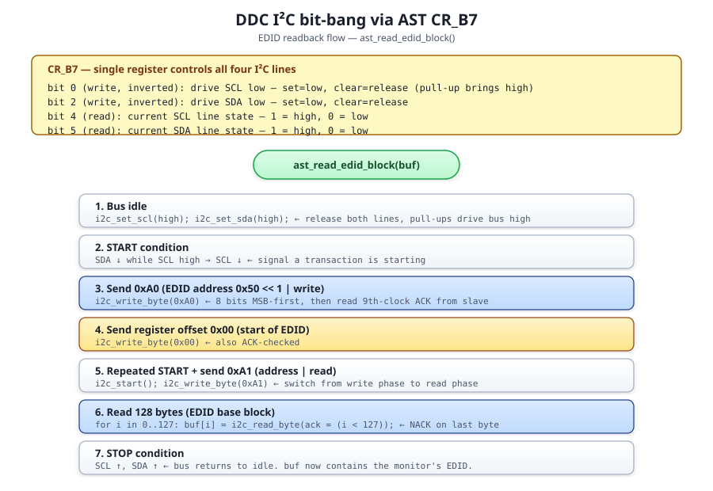
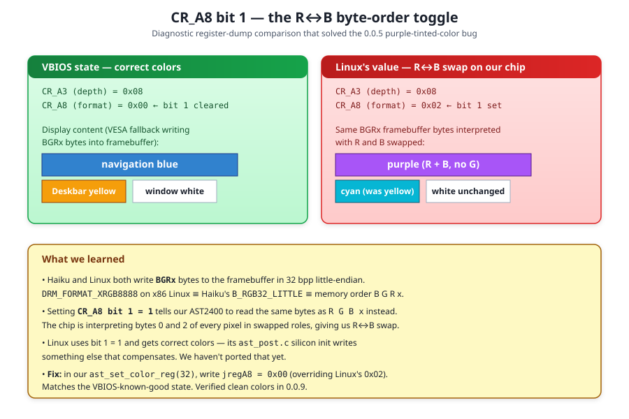

> [!NOTE]
> An LLM was used to aid in development of this code.


# AST2400 — Technical Documentation

This document is the consolidated technical reference for the
AST2400 (unofficial) Haiku graphics driver. It walks every shipped
milestone from 0.0.2 (first successful PCI probe) through 0.1.3
(defensive BAR-assignment validation), and explains the silicon-level
rationale, register-level porting decisions, and bring-up failures
encountered along the way.

The per-release line-item history lives in
[`CHANGELOG.md`](../CHANGELOG.md). This document is the *why* and
*how* companion: the silicon-level diagrams, the register
explanations, the diagnostic patterns we used, and the code citations
into upstream Linux.

> Repository: <https://github.com/KevinAdams05/AST2400>
> Author: Kevin Adams (with Claude Opus 4.7)
> Verified hardware: Supermicro X11SSH-LN4F (AST2400 rev 0x30) +
> HP V244h monitor
> Linux source mirror: `~/Code/Linux/linux/drivers/gpu/drm/ast/`

---

## Table of Contents

- [Driver Architecture](#driver-architecture)
- [ASPEED Hardware Family](#aspeed-hardware-family)
- [PCI and Register Interface](#pci-and-register-interface)
- [Phase 1 — Probe and Bind](#phase-1--probe-and-bind)
- [Phase 2 — Accelerant Skeleton](#phase-2--accelerant-skeleton)
- [Phase 3 — CRTC + PLL + DAC Programming](#phase-3--crtc--pll--dac-programming)
- [Phase 4.0 — Multi-Mode Support](#phase-40--multi-mode-support)
- [Phase 4.1 — EDID Readback via DDC](#phase-41--edid-readback-via-ddc)
- [Phase 4.2 — 1920×1080 and Extended DCLK Table](#phase-42--1920x1080-and-extended-dclk-table)
- [0.1.3 — Defensive BAR Validation](#013--defensive-bar-validation)
- [0.1.4 — 16:10 Widescreen Modes](#014--1610-widescreen-modes)
- [Bring-up Failures and Lessons](#bring-up-failures-and-lessons)
  - [SMAP violation on first ioctl (0.0.1)](#smap-violation-on-first-ioctl-001)
  - [Cloneable area flags (0.0.3 → 0.0.4)](#cloneable-area-flags-003--004)
  - [B\_RGB32\_BIG boot hang (0.0.6)](#b_rgb32_big-boot-hang-006)
  - [CR\_A8 bit 1 R↔B swap (0.0.5 → 0.0.9)](#cr_a8-bit-1-rb-swap-005--009)
- [Proposed Work](#proposed-work)
- [Files Modified](#files-modified)
- [Reference Material](#reference-material)

---

## Driver Architecture

The driver is the standard Haiku graphics-driver shape: a small
**kernel driver** that owns the PCI device and a **userspace
accelerant** that does the actual mode-setting work and exposes the
Haiku accelerant API to app_server.



| Component | Path | Runs in | Responsibilities |
|---|---|---|---|
| Kernel driver | `src/add-ons/kernel/drivers/graphics/ast/driver.cpp` | Kernel | PCI bind, BAR mapping, shared-area creation, ioctl handling |
| Accelerant | `src/add-ons/accelerants/ast/{accelerant,mode,ddc}.cpp` | User (in app_server) | Mode list, mode-set, CRTC/PLL/DAC programming, EDID readback |
| Shared header | `headers/private/graphics/ast/DriverInterface.h` | Both | `ast_shared_info` struct + ioctl ops |
| Register defs | `headers/private/graphics/ast/ast_regs.h` | Accelerant | Constants ported from Linux `ast_reg.h` |

The two sides communicate via:

1. **A shared memory area** (`ast_shared_info`) — created in the kernel
   driver's `ast_open`, cloned into the accelerant's address space in
   `init_accelerant` via `clone_area()`. Carries the chip generation,
   PCI info, BAR addresses, and the area IDs the accelerant needs to
   clone for direct MMIO + framebuffer access.
2. **Cloned BARs** — `area_id` references for BAR0 (framebuffer, 16 MB)
   and BAR1 (MMIO registers, 128 KB) are exposed through
   `ast_shared_info`. The accelerant calls `clone_area()` on each to
   get its own userspace mapping.
3. **ioctl** — `AST_GET_PRIVATE_DATA` is the one-time handshake the
   accelerant uses to bootstrap the cloning step.

This split mirrors what other Haiku graphics drivers do (radeon\_hd,
intel\_extreme). The kernel side is intentionally minimal — almost all
the chip-specific programming lives in the accelerant because it's
easier to develop and debug there. There is no IRQ handler yet (we
don't ack interrupts) and no real chip init beyond mapping BARs.

---

## ASPEED Hardware Family

The driver targets the ASPEED **AST2x00 family** of Baseboard
Management Controller (BMC) graphics chips. These are ubiquitous on
enterprise server motherboards (Supermicro, Dell, HPE, Asus
server-line, etc.). The BMC is its own SoC running in parallel with
the host CPU, and it exposes one of its functions — a 2D VGA / display
controller — to the host over PCI.

| Chip | PCI revision range | Year introduced | Notes |
|---|---|---|---|
| AST2100 | 0x01–0x0f | ~2008 | PCI Express interface introduced |
| AST2200 | 0x10–0x1f | ~2009 | Refresh |
| AST2300 | 0x20–0x2f | ~2011 | Substantial refresh; "modern" feature set |
| **AST2400** | **0x30–0x3f** | **~2013** | **Our verified target** |
| AST2500 | 0x40–0x4f | ~2016 | DDR4, faster ARM cores |
| AST2600 | 0x50–0x5f | ~2019 | DCN-style display block; significant register-layout changes |

All members of this family present PCI vendor `0x1a03` device `0x2000`
to the host. The driver distinguishes them at runtime via the PCI
revision register — `revision_to_generation()` in
[`driver.cpp`](../src/add-ons/kernel/drivers/graphics/ast/driver.cpp)
applies the same revision-byte ranges Linux uses in
`ast_detect_chip()`.

ASPEED maintained **register-level backward compatibility** through
AST2300 → AST2400 → AST2500 — the same VGA-style I/O port indexes
(CR\*, SR\*, GR\*, AR\*) and extension-register layout, the same PLL
register set (CR\_C0 / CR\_C1 / CR\_BB), the same display engine
register block. This is why the AST2500 Software Programming Guide
(833 pages, 2017) covers AST2400 work too.

AST2600 broke from this — its display block (the "DCN-class" successor)
has a different register layout. The driver targets the AST2300–2500
window for now; AST2600 support is future work.

---

## PCI and Register Interface



The chip exposes the host-visible display block through two PCI Base
Address Registers:

- **BAR0 — framebuffer.** A 16 MB region on AST2400. The chip scans
  out pixels directly from this memory. The host writes pixel data
  here; the chip's display engine reads it according to the CRTC /
  format / pitch registers programmed via BAR1.
- **BAR1 — MMIO registers.** A 128 KB region. The legacy VGA I/O port
  space starts at offset `0x380` within BAR1 — port `0x3C0` (VGA
  attribute index) maps to MMIO address `BAR1 + 0x3C0`, port `0x3D4`
  (CRTC index) to `BAR1 + 0x3D4`, and so on. Extension registers
  (ASPEED-specific) live in the VGA-CRTC indexed register space at
  indexes ≥ 0x80.

### Indexed register access

Most of the AST's interesting registers are *indexed*: you write an
index to a "select" port, then read or write the data port. For
example, to set CRTC register 0x12:

```
write port 0x3D4 (CRTC index)  = 0x12   # select CR12
write port 0x3D5 (CRTC data)   = <val>  # set CR12 = val
```

In our MMIO-based access, `0x3D4` becomes `BAR1 + 0x3D4` and
`0x3D5` becomes `BAR1 + 0x3D5`. The driver's `set_index_reg(base,
index, value)` helper (in `mode.cpp`) encapsulates this two-step
write; `get_index_reg(base, index)` does the read variant.

### Register groups used by this driver

| Base | Group | Use |
|---|---|---|
| `0x44` (SR index) | Sequencer regs SR00–SR07 | Memory mode, chain-4, clocking |
| `0x4E` (GR index) | Graphics regs GR00–GR08 | Pixel format, write/read mode |
| `0x40` (AR index) | Attribute regs AR00–AR14 | Palette, mode control, overscan |
| `0x54` (CR index) | CRTC regs CR00–CR18 | Display timing |
| `0x54` (CR index) | Extension regs CR80–CRFF | ASPEED-specific (color, PLL, DDC, ...) |

The extension registers gate behind a password write to CR80 — see
`ast_open_key()`. Without this unlock, writes to CR80+ are ignored.

---

## Phase 1 — Probe and Bind

**Released:** 0.0.2 — 2026-05-28

**Scope.** Detect the chip on the PCI bus, map its BARs, create the
accelerant shared area, expose a `/dev/graphics/ast_<bus><dev><fn>`
device node, log a one-line inventory of what was found.

### What lands

`driver.cpp::probe_devices()` iterates every PCI device on every bus
and matches vendor `0x1a03` + device `0x2000`. For each match it:

1. Allocates a per-device `ast_device_info` cookie.
2. Decodes the PCI revision byte into a generation enum
   (`revision_to_generation`).
3. Constructs the device path (`graphics/ast_060000` on our
   X11SSH-LN4F — bus 6, device 0, function 0).
4. Logs the inventory line:
   ```
   ast: probed graphics/ast_060000: AST2400 rev 0x30 at [bus 6
   device 0 function 0], BAR0 16 MB, BAR1 0xdf000000 (131072 B)
   ```

When app_server later opens the published device node, `ast_open()`
maps BAR0 (framebuffer) and BAR1 (MMIO) into kernel space via
`map_physical_memory()`, creates the accelerant shared area, and
populates it with the chip's PCI info + the BAR area IDs.

### Linux reference

- `drivers/gpu/drm/ast/ast_drv.c::ast_pci_probe`
- `drivers/gpu/drm/ast/ast_drv.c::ast_detect_chip` (revision → generation)

The revision-byte ranges come straight from `ast_detect_chip()` —
0x10/0x20/0x30/0x40/0x50 as the per-family floors.

### Verification

Boot syslog shows the probe lines plus `ast_open → ast_close` round
trip — the round trip happens because app\_server tries to load
`ast.accelerant` to negotiate a mode, fails to find it in 0.0.2
(no accelerant exists yet), and moves on to VESA. The driver
nonetheless reports a clean PCI bind.

---

## Phase 2 — Accelerant Skeleton

**Released:** 0.0.3 (with bugs) → 0.0.4 (working).

**Scope.** Implement the Haiku accelerant API surface so app\_server
treats our driver as a valid graphics device. Doesn't yet program the
chip — `set_display_mode` is a stub that accepts only the single
hardcoded 1024×768@60 mode and returns success without actually
touching any chip registers.

### Hook table

Haiku's accelerant ABI is a `get_accelerant_hook(feature, data)`
dispatch function. The accelerant addon exports this single entry
point; everything else is reachable through it. Implemented hooks:

- `B_INIT_ACCELERANT` / `B_UNINIT_ACCELERANT` — bookkeeping
- `B_GET_ACCELERANT_DEVICE_INFO` — chip name, memory size, DAC speed
- `B_ACCELERANT_MODE_COUNT` / `B_GET_MODE_LIST` — mode list
- `B_PROPOSE_DISPLAY_MODE` — mode validation
- `B_SET_DISPLAY_MODE` — mode-set entry
- `B_GET_DISPLAY_MODE` — current mode reporting
- `B_GET_FRAME_BUFFER_CONFIG` — framebuffer base + stride
- `B_GET_PIXEL_CLOCK_LIMITS` / `B_GET_TIMING_CONSTRAINTS` — range info
- `B_CLONE_ACCELERANT` / `B_ACCELERANT_CLONE_INFO_SIZE` /
  `B_GET_ACCELERANT_CLONE_INFO` — workspace-secondary-head support

### init_accelerant: the shared-area handshake

The accelerant doesn't have direct access to PCI scan results — that
data lives in the kernel driver. The bootstrap dance:

1. Accelerant calls `ioctl(fd, AST_GET_PRIVATE_DATA, ...)` with a
   buffer containing the `AST_PRIVATE_DATA_MAGIC` value.
2. Kernel driver checks the magic and writes back the `area_id` of
   the per-device `ast_shared_info` area it created in `ast_open`.
3. Accelerant calls `clone_area()` on that area_id, getting a userspace
   pointer to `ast_shared_info`.
4. The struct contains the area IDs of BAR0 + BAR1. Accelerant clones
   those too, ending up with userspace pointers to the framebuffer and
   MMIO register window.

After this, the accelerant has everything it needs to run mode-sets
without further kernel involvement — it can read/write any AST
register directly through its cloned BAR1 mapping.

---

## Phase 3 — CRTC + PLL + DAC Programming

**Released:** 0.0.5 (geometry right, R↔B swap) → 0.0.9 (clean
1024×768).

**Scope.** Actually program the chip for the requested display mode.
Convert `set_display_mode` from a no-op stub into a real
register-write sequence that puts the chip in the requested resolution.

This is the heaviest chunk of porting work in the driver — most of the
mode-set logic ports from Linux `drivers/gpu/drm/ast/ast_mode.c`. The
silicon model is essentially "extended VGA": a classic VGA register
set (sequencer, CRTC, attribute, graphics, DAC) plus an ASPEED-specific
extension-register block at indexes 0x80+ within the CRTC index space.

### Mode-set sequence



`ast_program_mode(const ast_mode_info*)` in `mode.cpp` is the entry
point. It runs this ordered sequence:

1. **Wait for vertical retrace.** Avoid reprogramming the CRTC while
   it's actively scanning out a frame. `ast_wait_for_vretrace()` polls
   `VGAIR1` register, bit 3, with a 100 ms timeout.
2. **Open extension keys.** Write the magic `0xA8` to CR80 to unlock
   writes to extension registers (CR80+). Without this, our writes are
   silently ignored.
3. **Write VBIOS mode metadata.** Extension registers CR8D, CR8E, CR91,
   CR92, CR93–97 record the mode ID, refresh rate index, pixel clock
   in MHz, active dimensions, and color depth — useful for IPMI / iKVM
   clients running on the BMC.
4. **CRA1 = 0x06.** Bit 1 disables legacy VGA I/O port access (chip
   responds only to MMIO from this point). Mirrors what Linux does
   right before the std register sweep.
5. **Standard VGA register sweep.** `ast_set_std_reg(stdtable)` writes
   the contents of the chosen `ast_std_table` to all standard VGA
   register groups. For 32 bpp we use `AST_STD_TRUEC_MODE` — its
   sequencer / attribute / graphics defaults are the right starting
   point for non-palettized truecolor.
6. **CRTC timing.** `ast_set_crtc_reg(mode)` writes the per-mode
   timing values (h\_total, h\_sync\_start, h\_sync\_end, v\_total,
   etc.) into CR00–CR16 and the extension regs CRAC / CRAD / CRAE for
   the high bits.
7. **PLL.** `ast_set_dclk_reg(dclk_index)` looks up
   `kDclkTable[dclk_index]` and writes the PLL parameters to CR\_C0,
   CR\_C1, and CR\_BB.
8. **Sync polarity.** `ast_set_sync_reg(mode)` writes bits 6-7 of VGAMR
   (port 0x3C2) — bit 6 = horizontal sync inverted, bit 7 = vertical
   sync inverted.
9. **Color depth.** `ast_set_color_reg(32)` writes CR\_A0 / CR\_A3 /
   CR\_A8 for the format selection.
10. **Pitch and scanout start.** `ast_set_offset_reg(bytes_per_row)`
    sets CR13 + CR\_B0; `ast_set_start_address(0)` sets CR\_0C / CR\_0D
    / CR\_AF to the scanout origin (always offset 0 within BAR0 for us).

### PLL parameters

`kDclkTable[]` in `mode.cpp` is ported verbatim from Linux's
`ast_2000_dclk_table[]`. AST2400 inherits the AST2000-era PLL math
per `ast_2400_init()` in Linux. Each entry is three bytes — `param1`
goes to CR\_C0, `param2` goes to CR\_C1, `param3` goes to CR\_BB high
nibble. The math behind the bit packing is documented in the AST2500
Software Programming Guide §1.2.

We don't compute PLL parameters from a target clock — we look them up
in the table by mode index. That's fine for the small fixed set of
modes we expose; computing the parameters dynamically would let us
support arbitrary EDID-derived timings, but that's Phase 5+ work.

### Verification

Visual: clean Haiku desktop at 1024×768@60 on the Supermicro test
bench. See `docs/screenshots/phase3-1024x768.png`.

Syslog:

```
ast.mode: program_mode: 1024x768@60Hz 32bpp on AST chip gen 4
ast.mode: program_mode: done
```

The R↔B color swap that landed in 0.0.5 and stuck around until 0.0.9
is documented in detail in
[CR\_A8 bit 1 R↔B swap](#cr_a8-bit-1-rb-swap-005--009) below.

---

## Phase 4.0 — Multi-Mode Support

**Released:** 0.0.10 — 2026-05-28.

**Scope.** Grow the mode list from one hardcoded entry to a real
multi-mode array. Lets users actually pick a resolution from Haiku's
Screen preferences.

### What changed

- `kModeList[]` in `mode.cpp` — 5 entries (640×480, 800×600, 1024×768,
  1280×1024, 1600×1200) ported from Linux's `res_*` enhtables. All at
  60 Hz, 32 bpp, 4:3 aspect ratio.
- `kHaikuModes[]` in `accelerant.cpp` — matching `display_mode`
  entries, same array indexing as `kModeList`.
- `ast_program_mode_1024x768()` → `ast_program_mode(const
  ast_mode_info*)` — generic for any mode in the table.
- `find_mode_index(width, height)` helper.
- `sCurrentModeIndex` — accelerant-side tracker so `GET_DISPLAY_MODE`
  reflects the actually-active mode after `SET_DISPLAY_MODE` runs.
- Framebuffer-size validation — `SET_DISPLAY_MODE` rejects modes
  whose `width × height × 4` exceeds the BAR0 framebuffer size. On
  the AST2400's 16 MB, that allows up through ~2048×2048 at 32 bpp.

### Dynamic mode switching

Because the accelerant's `SET_DISPLAY_MODE` re-runs the full mode-set
sequence (CRTC, PLL, sync, color), the user can switch resolutions
from Screen preferences without a reboot. This was verified live —
1600×1200 → 1280×1024 on the X11SSH-LN4F took a couple seconds with
no glitches.

---

## Phase 4.1 — EDID Readback via DDC

**Released:** 0.0.11 — 2026-05-28.

**Scope.** Implement I2C bit-bang over the AST's DDC pins and read
the 128-byte EDID block from the attached monitor. Don't yet use it
to filter the mode list — Phase 4.2 — but log the parsed EDID so we
can verify the readback works.



### The CR_B7 register

The AST's DDC SDA / SCL pins are controlled through a single
extension register, CR\_B7. The bit layout (from Linux's
`ast_ddc.c`):

| Bit | Direction | Meaning |
|---|---|---|
| 0 | output (inverted) | Drive SCL low. Set this bit to pull SCL down; clear to release. |
| 2 | output (inverted) | Drive SDA low. Same pattern. |
| 4 | input | SCL line state. 1 = high, 0 = low. |
| 5 | input | SDA line state. 1 = high, 0 = low. |

The "inverted" semantics: writing `1` to bit 0 actively drives SCL
low; writing `0` releases SCL and the bus pull-up resistor brings it
high. Same for SDA at bit 2. This is the standard "open-drain"
behaviour of every real I²C controller.

### What we ported and what we didn't

`ddc.cpp` reimplements the I²C protocol — START, STOP, write-byte
with ACK, read-byte with ACK/NACK — by directly manipulating bits 0
and 2 of CR\_B7 and reading bits 4 and 5. Linux uses the kernel's
`i2c_algo_bit_data` framework for this; Haiku doesn't have a userspace
equivalent, so the protocol is hand-rolled.

The implementation is "good enough" — no arbitration, no clock
stretching support, no error recovery beyond aborting. For an EDID
readback over a directly-attached cable, that's sufficient. A more
robust implementation would matter for monitors that aggressively
stretch the clock or for chains of I²C devices behind a hub, neither
of which is in scope.

### Timing

20 µs between each line transition (`snooze(20)`). Slow by I²C
standards — the spec allows up to 100 kHz (10 µs per half-cycle)
without effort, and the AST hardware can probably go much faster.
20 µs is what Linux uses (`udelay(20)`), and it works first try.

### EDID parse

`ast_log_edid()` extracts the parts useful for an initial sanity
check:

- The 8-byte EDID signature (`00 ff ff ff ff ff ff 00`) confirms we're
  reading real EDID data.
- The 3-letter manufacturer code (5+5+5 bits packed into 2 bytes at
  bytes 8-9).
- The product ID and serial number.
- The first detailed timing descriptor (DTD), which gives the
  monitor's preferred timing — typically the LCD's native resolution.

On the test bench:

```
ast.ddc: manufacturer: HPN  product: 0x3359  serial: 0x01010101
ast.ddc: week 50  year 2017  EDID ver 1.3
ast.ddc: preferred timing: 1920 x 1080 @ 148500 kHz pixel clock
```

— an HP V244h. The preferred 1920×1080 @ 148.5 MHz is what drove the
0.1.2 mode-list expansion below.

---

## Phase 4.2 — 1920×1080 and Extended DCLK Table

**Released:** 0.1.2 — 2026-05-28.

**Scope.** Add 1920×1080@60 to the mode list. The EDID readback in
0.0.11 made it obvious this was the practical next step — every modern
desktop monitor lists 1920×1080 as a preferred or supported mode.

### DCLK table extension

The previous mode list bottomed out at VCLK162 (1600×1200's pixel
clock) — table index 0x0F. 1920×1080@60 needs VCLK148_5 at index
0x14. We added 5 more entries (`0x10` through `0x14`) to `kDclkTable`,
ported verbatim from Linux:

| Index | Symbol | PLL params (param1, param2, param3) |
|---|---|---|
| 0x10 | VCLK154 | 0x4d, 0x4c, 0x80 |
| 0x11 | VCLK83\_5 | 0x68, 0x6f, 0x80 |
| 0x12 | VCLK106\_5 | 0x28, 0x49, 0x80 |
| 0x13 | VCLK146\_25 | 0x37, 0x49, 0x80 |
| 0x14 | VCLK148\_5 | 0x1f, 0x45, 0x80 |

The `0x80` bit in param3 sets the "high PLL range" bit when the
parameters go into CR\_BB. Our existing `ast_set_dclk_reg()`
implementation already handled this — `param3 & 0xc0` gets the high
bits and `(param3 & 0x3) << 4` the low bits, exactly matching Linux.

### Flags we set but don't act on

The Linux table for 1920×1080 sets `AST2500PreCatchCRT`,
`WideScreenMode`, and `NewModeInfo`. We carry these flags on our entry
for forward compatibility but none of them affect AST2400:

- `AST2500PreCatchCRT` only fires when the chip's `quirks` struct
  sets `crtc_hsync_precatch_needed`, which AST2400 doesn't.
- `WideScreenMode` and `NewModeInfo` only gate additional VBIOS mode
  metadata writes that we already do unconditionally.

### Verification

`screeninfo` reports `1920 × 1080` after switching to the new mode in
Screen preferences. No glitches; switching back to 1024×768 also
clean.

---

## 0.1.3 — Defensive BAR Validation

**Released:** 0.1.3 — 2026-05-28.

**Scope.** Refuse to bind devices whose PCI BARs are unassigned or
nonsense, so the driver doesn't blindly run `map_physical_memory(0,
16 MB)` and produce confusing failure modes.

### Why this matters

Haiku ticket [#3](https://dev.haiku-os.org/ticket/3) (open since 2005)
notes that the Haiku PCI bus manager does not assign memory resources
to devices whose BARs the BIOS left unprogrammed. On most server
boards — including every Supermicro X11 we'd plug an AST chip into —
the BIOS does its job and BARs come up correctly assigned. But on
problematic boards (some consumer hardware, some less-careful UEFI
firmware), we'd see `pci_info.u.h0.base_registers[0] = 0` and
`base_register_sizes[0] = 0`.

Without validation, `ast_open()` would call `map_physical_memory(0,
16 MB)` which on Haiku tends to either return garbage memory mappings
or fail in an obscure way. Either is a worse user experience than just
"this driver isn't going to work on this board."

### What we check

`validate_bars(const pci_info&)` in `driver.cpp::probe_devices()`:

- BAR0 base != 0 and size != 0
- BAR1 base != 0 and size != 0
- Both BARs are above 1 MB physical (system DRAM lives below that;
  a BAR pointing there is definitely garbage)

On failure, we log a clear error pointing at Haiku ticket #3 so a
user can find the upstream root cause, and return
`B_DEV_RESOURCE_CONFLICT` from probe. The PCI device stays
unclaimed; Haiku's VESA fallback handles display output.

---

## 0.1.4 — 16:10 Widescreen Modes

**Released:** 0.1.4 — 2026-06-27.

**Scope.** Add the four standard 16:10 resolutions — 1280×800 (WXGA),
1440×900 (WXGA+), 1680×1050 (WSXGA+), and 1920×1200 (WUXGA) — so
16:10 panels run at native resolution instead of letterboxing down to
a 16:9 mode. Ported from Linux `ast_vbios.c` (`res_1280x800` /
`res_1440x900` / `res_1680x1050` / `res_1920x1200`).

### No new PLL work

This dropped in cleanly because the DCLK table extension done back in
0.1.2 (for 1920×1080) already added the PLL parameters these modes
need — VCLK83\_5 (0x11), VCLK106\_5 (0x12), VCLK146\_25 (0x13), and
VCLK154 (0x10) were ported "for table completeness" at the time and
sat unused. 0.1.4 simply wires four mode entries to them. The mode
arrays grow from 6 to 10 lockstep entries (`kModeList[]` in `mode.cpp`,
`kHaikuModes[]` in `accelerant.cpp`, same index in both). Entries were
*appended*, not inserted, so the `sCurrentModeIndex = 2` default still
points at 1024×768.

### The 1920×1200 pixel-clock constraint

1920×1200 has two common timings: standard-blanking DMT at **193 MHz**
and CVT reduced-blanking at **154 MHz**. The AST2400 RAMDAC tops out
around 165 MHz (`GET_PIXEL_CLOCK_LIMITS` reports a 165 MHz ceiling),
so the 193 MHz timing is unreachable — we use the 154 MHz
reduced-blanking variant, which is also what real WUXGA panels report
as their EDID *preferred* timing. The other three 16:10 modes are
comfortably under the ceiling and use standard (non-RB) DMT timings.

| Mode | Pixel clock | DCLK index | Blanking |
|---|---|---|---|
| 1280×800 | 83.5 MHz | VCLK83\_5 | standard DMT |
| 1440×900 | 106.5 MHz | VCLK106\_5 | standard DMT |
| 1680×1050 | 146.25 MHz | VCLK146\_25 | standard DMT |
| 1920×1200 | 154 MHz | VCLK154 | reduced-blanking |

### Sync polarity — mind the SyncXY convention

Linux's `ast_vbios.h` defines `SyncPN`, `SyncNP`, etc. where the
**first** letter is the *vertical* polarity and the second is
horizontal — easy to read backwards. So:

- 1280×800 / 1440×900 / 1680×1050 are `SyncPN` → V positive, H
  negative → `AST_FLAG_PVSYNC | AST_FLAG_NHSYNC`.
- 1920×1200 (RB) is `SyncNP` → V negative, H positive →
  `AST_FLAG_NVSYNC | AST_FLAG_PHSYNC`.

`ast_set_sync_reg()` only acts on the two negative-polarity flags
(setting bits 6/7 of the Misc Output register), so getting these
right is what makes the monitor lock instead of showing "out of
range."

### Flags omitted

As with 1920×1080, Linux sets `AST2500PreCatchCRT` on the
reduced-blanking variants; it's AST2500/2600-only and a no-op on
AST2400, so we leave it off our entries.

### Verification

On the Supermicro X11SSH-LN4F, driving an **ASUS WUXGA panel**. EDID
readback reports the panel's preferred timing exactly:

```
ast.ddc: manufacturer: AUS  product: 0x2487  serial: 0x01010101
ast.ddc: week 31  year 2025  EDID ver 1.3
ast.ddc: preferred timing: 1920 x 1200 @ 154000 kHz pixel clock
```

Switching to 1920×1200 in Screen preferences programs cleanly
(`program_mode: 1920x1200@60Hz 32bpp` → done, no KDL) and the picture
is sharp and correctly positioned.

> **Note:** EDID-driven *auto-selection* is still not implemented
> (that's the remaining Phase 4.x work). app_server defaults to a
> previously-used mode rather than reading the EDID preferred timing,
> so 16:10 has to be selected manually in Screen preferences once.

---

## Bring-up Failures and Lessons

The driver's journey from 0.0.1 to 0.1.4 hit four instructive
failures. Each is worth a section because the pattern of "test on
hardware → observe → narrow → fix" generalizes to future graphics-
driver work.

### SMAP violation on first ioctl (0.0.1)

**Symptom.** Kernel debugger:

```
PANIC: SMAP violation user-mapped address 0x00007ff811171b90
       touched from kernel 0xffffffff80183984
```

Backtrace pointed at `ast_control + 0x40` — the first ioctl path.

**Root cause.** Modern x86_64 CPUs enable SMAP (Supervisor Mode
Access Prevention), which traps if kernel code dereferences a
userspace pointer without going through the kernel's explicit
user-access primitives. Our `ast_control` was doing
`strcpy((char*)arg, AST_ACCELERANT_NAME)` — directly writing through
a userspace buffer from kernel code. That's invalid on a SMAP-enabled
system.

**Why we did the wrong thing.** Haiku's skeleton graphics driver
(`src/add-ons/kernel/drivers/graphics/skeleton/`) dates from 1999 and
predates SMAP enforcement. The patterns it uses (direct
`strcpy`/`memcpy` on ioctl args) compile cleanly on modern Haiku but
trap at runtime on modern CPUs.

**Fix.** Use Haiku's `user_strlcpy()` and `user_memcpy()` for all
ioctl data transfers, matching the canonical pattern in
`radeon_hd/device.cpp:186-191`. These wrappers know how to bridge the
SMAP barrier safely.

**Lesson.** Any kernel driver written against the Haiku skeleton
needs to be audited for direct userspace-pointer dereferences. The
skeleton is structurally useful as a starting point but its
SMAP-unaware idioms are now bugs.

### Cloneable area flags (0.0.3 → 0.0.4)

**Symptom.** Phase 2 (accelerant) shipped in 0.0.3. Booted cleanly,
kernel driver bound, accelerant `.hpkg` was installed at the right
path — but app\_server still picked VESA as the active driver. No
visible "accelerant failed" error in syslog. `screeninfo` reported
`Framebuffer Driver`, not `ASPEED Graphics`.

**Root cause.** The kernel driver created the `ast_shared_info` /
MMIO / framebuffer areas with protection
`B_KERNEL_READ_AREA | B_KERNEL_WRITE_AREA`. The accelerant tried to
`clone_area()` them from userspace and got an immediate error — the
source areas weren't marked cloneable. `init_accelerant` returned the
error, app\_server received it, and silently moved to the next
graphics driver.

**Fix.** Add `B_CLONEABLE_AREA` to the area-protection flags on the
kernel side. Matches the radeon_hd / intel_extreme pattern:

```cpp
device->registersArea = map_physical_memory(name, regsPhys, regsSize,
    B_ANY_KERNEL_ADDRESS,
    B_KERNEL_READ_AREA | B_KERNEL_WRITE_AREA | B_CLONEABLE_AREA,
    (void**)&device->registers);
```

**Lesson.** Areas the accelerant needs to access must be explicitly
cloneable on the kernel side. The accelerant-side `clone_area()` call
will silently fail if the source is kernel-only, and app\_server's
fallback path doesn't log accelerant init failures by default. When
debugging accelerant-not-loading symptoms, check the area-protection
flags first.

Also worth knowing: the accelerant's stderr does **not** go to syslog
from inside app\_server's process. Use `_sPrintf()` from
`<Debug.h>` instead. The 0.0.3 accelerant's TRACE was
`fputs(buf, stderr)` and produced zero syslog output — which masked
the clone failure. 0.0.4 switched to `_sPrintf()` (matching
`radeon_hd/accelerant.cpp:39`) and the error path became visible.

### B\_RGB32\_BIG boot hang (0.0.6)

**Symptom.** Tried fixing the R↔B color swap (next section) by
changing the accelerant's mode `color_space` from `B_RGB32_LITTLE`
to `B_RGB32_BIG`. Boot hung at black screen, network down, hard
power-cycle required.

**Root cause.** Not fully understood — likely `B_RGB32_BIG` triggers
a code path in app\_server that wasn't intended for graphics drivers
that don't natively support byte-swapped scanout. Whatever
happened, it took down boot before networking came up.

**What we learned that's worth keeping.** Linux uses
`DRM_FORMAT_XRGB8888` for the AST chip — that's memory byte order
**BGR-** on little-endian x86, exactly equivalent to Haiku's
`B_RGB32_LITTLE`. So Linux and Haiku write the same byte order to
memory. The R↔B swap was always chip-side, not host-side.

**Lesson.** Verify the upstream driver's pixel-format assumptions
before touching color-space values in your accelerant. The naive
"swap the color space" fix is almost never right; it's the wrong
layer.

### CR_A8 bit 1 R↔B swap (0.0.5 → 0.0.9)

**Symptom.** Phase 3 (mode-set programming) shipped in 0.0.5. The
chip drove the display correctly at 1024×768 geometry-wise, but
colors were rotated — yellow became cyan, blue became magenta. The
Haiku navigation-blue desktop showed up as deep purple.



**Diagnostic.** We added an `dump_color_regs()` helper that
captured the chip's color-control register state before and after
the mode-set sequence (0.0.8). The dump:

```
== color/format regs BEFORE ==
  CR_A3 (depth)    = 0x08
  CR_A8 (format)   = 0x00     <-- VBIOS state, correct colors via VESA
== color/format regs AFTER ==
  CR_A3 (depth)    = 0x08
  CR_A8 (format)   = 0x02     <-- our writes, R↔B swap visible
```

The single bit difference — CR\_A8 bit 1 — was the swap toggle.
Before: 0 (VBIOS left it clear, VESA fallback rendered correctly).
After: 1 (we set it to match Linux's `ast_set_color_reg(32)`).

**Why Linux can use the bit Linux uses and still get correct
colors.** Linux runs additional silicon-init code in `ast_post.c`
that we haven't ported — likely those writes reconfigure another
register that compensates for the CR_A8 bit 1 effect. We didn't
investigate further; the empirical fix is to match the
VBIOS-known-good state.

**Fix.** Override the Linux value for 32 bpp in our
`ast_set_color_reg(32)`:

```cpp
case 32:
    jregA0 = 0x70;
    jregA3 = 0x08;
    // Linux sets bit 1; on our AST2400 with Haiku's BGR- memory byte
    // order, that bit toggles the chip's interpretation and gives
    // R↔B swap. VBIOS leaves bit 1 clear and renders correctly with
    // identical memory contents.
    jregA8 = 0x00;
    break;
```

**Lesson.** When porting from a reference driver, the assumption
"matching upstream values must be right" is dangerous. Empirically
compare the chip state your driver leaves vs. the chip state a
known-working setup (VBIOS / VESA fallback) produces — the diff tells
you which writes are doing what. Diagnostic register dumps are
worth the boilerplate; they were the single highest-leverage tool of
the entire bring-up.

---

## Proposed Work

### Phase 4.3 — 16:9 / widescreen modes

Add 1280×720, 1366×768, 1600×900, 1920×1200 and similar widescreen
modes. The DCLK table after 0.1.2 has plenty of room (indices 0x10
onwards). Mostly mechanical: port the timing entries from Linux's
`res_*` enhtables and add matching `display_mode` entries to the
Haiku-side array. Validate framebuffer-fit per mode.

### Phase 4.4 — EDID-driven mode filtering

Parse the EDID's "established timings" byte, "standard timings", and
detailed timing descriptors. Cross-reference against the hardcoded
mode list and hide modes the monitor doesn't claim to support. Adds
real per-monitor mode lists instead of the "every mode for every
monitor" approach of 0.1.2.

The EDID parse code lives in `ddc.cpp::ast_log_edid()` — that decode
just needs to be extended to write into a filter table that
`ast_get_mode_list` consults.

### Phase 5 — AST2500 / AST2600 silicon-init deltas

The driver's revision-byte detection already classifies AST2500
and AST2600 generations correctly, but the mode-set code paths
haven't been exercised on those chips. Linux has per-generation
files (`ast_2500.c`, `ast_2600.c`) with silicon-init quirks —
`crtc_hsync_precatch_needed` is the only one our enhtable flags
acknowledge. Port the rest as hardware becomes available.

### Phase 6 — Hardware cursor + 2D acceleration

The AST has a hardware cursor block (CR\_CB controls it) and a 2D
acceleration engine for BitBlt / solid-fill / line drawing. Both
are documented in the AST2500 SPG. Neither has been ported. Should
both deliver meaningful perf for a desktop session vs. the current
all-software-rendering path.

### Phase 7 — DPMS / power management

`ast_set_sync_reg()` already programs sync polarity; adding DPMS off
states is one more register write (CR\_B6 bits 0 and 1 disable
horizontal / vertical sync respectively). Hook into Haiku's
screen-saver hook so the monitor can power down.

---

## Files Modified

The driver lives in two source trees plus the headers and packaging
boilerplate:

### Kernel driver — `src/add-ons/kernel/drivers/graphics/ast/`

| File | First introduced | Description |
|---|---|---|
| `driver.cpp` | 0.0.2 | PCI bind, BAR mapping, shared-area creation, ioctl handling, BAR validation (0.1.3) |
| `Jamfile` | 0.0.2 | Kernel addon build target |

### Accelerant — `src/add-ons/accelerants/ast/`

| File | First introduced | Description |
|---|---|---|
| `accelerant.h` | 0.0.3 | `ast_accelerant_info` per-instance struct, gInfo declaration |
| `accelerant.cpp` | 0.0.3 | Haiku accelerant hook table; init/uninit/clone; mode-list & framebuffer config |
| `mode.cpp` | 0.0.5 | Chip mode-set: PLL, CRTC, DAC, color, sync. Plus tables: stdtable, dclk, modelist |
| `ddc.cpp` | 0.0.11 | I²C bit-bang + EDID readback + EDID parse |
| `Jamfile` | 0.0.3 | Accelerant addon build target |

### Shared headers — `headers/private/graphics/ast/`

| File | First introduced | Description |
|---|---|---|
| `DriverInterface.h` | 0.0.2 | `ast_shared_info` struct, ioctl ops, PCI constants, chip-generation enum |
| `ast_regs.h` | 0.0.5 | Register-address constants, VCLK indexes, table-struct types |

### Packaging — `packaging/` and `scripts/`

| File | First introduced | Description |
|---|---|---|
| `packaging/PackageInfo.in` | 0.0.2 | Package metadata template |
| `scripts/build.sh` | 0.0.2 | Source overlay onto Haiku tree + jam build |
| `scripts/package.sh` | 0.0.2 | Wrap binaries into `.hpkg` |

---

## Reference Material

### Linux source

Primary porting reference. Path:
`~/Code/Linux/linux/drivers/gpu/drm/ast/`.

| File | Used for |
|---|---|
| `ast_drv.{c,h}` | PCI bind, chip-generation detection, helper inlines for indexed-register access |
| `ast_mode.c` | Mode-set sequence — `ast_set_std_reg`, `ast_set_crtc_reg`, `ast_set_dclk_reg`, `ast_set_color_reg`, `ast_set_sync_reg`, `ast_set_offset_reg`, `ast_set_start_address_crt1`, `ast_set_vbios_mode_reg`, `ast_wait_for_vretrace` |
| `ast_ddc.c` | I²C bit-bang pattern on CR\_B7 |
| `ast_reg.h` | Register address constants and bit flags |
| `ast_tables.h` | Standard VGA register defaults (`vbios_stdtable`) |
| `ast_vbios.{c,h}` | Per-mode timing tables (`res_640x480`, `res_1024x768`, ..., `res_1920x1080`) and enhtable struct layout |
| `ast_2000.c` | `ast_2000_dclk_table[]` — PLL parameters |
| `ast_2400.c` | AST2400-specific quirks (chip we target) |


### Haiku conventions

| Resource | Used for |
|---|---|
| Haiku graphics driver model | Kernel driver / accelerant split, `device_hooks` shape, Jam build conventions |
| `src/add-ons/kernel/drivers/graphics/skeleton/` | Structural starting point (with SMAP-aware updates) |
| `src/add-ons/kernel/drivers/graphics/radeon_hd/` | Modern Haiku graphics driver — used as reference for ioctl SMAP-safe patterns, area-clone protection flags, accelerant logging style |
| `src/add-ons/accelerants/common/` | `libaccelerantscommon.a` — provides Haiku-side helpers for mode-list generation, EDID parsing (which we'll consume in Phase 4.4) |

### Haiku ticket cross-reference

| Ticket | Relation |
|---|---|
| [#3](https://dev.haiku-os.org/ticket/3) — PCI bus_manager does no memory resource assignment | Root cause of generic BAR-unassigned issues. We added defensive validation in 0.1.3 because of this. |
| [#20025](https://dev.haiku-os.org/ticket/20025) — Idualwifi7260 BAR0 unassigned | Same-class symptom on a different chip. Prior analysis informed the 0.1.3 defensive checks. |
